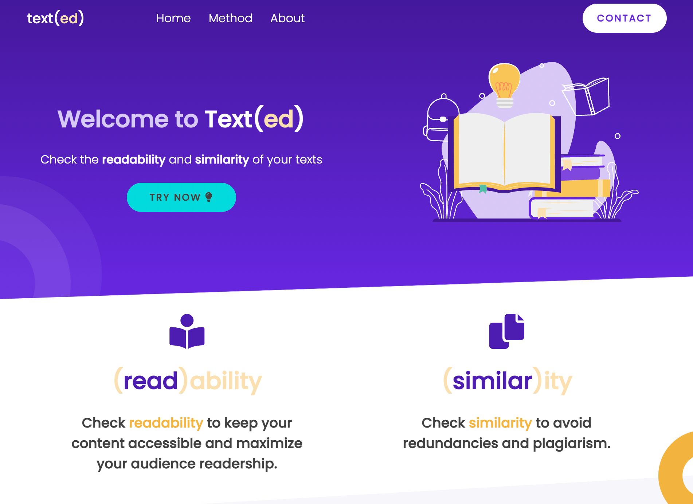

# Texted

## Welcome / Bem vindo!

Thanks for checking out my front-end project. 
🇧🇷/🇵🇹 *Obrigado por conferir meu projeto de front-end.*

## Overview

Texted is a web-based application that evaluates the **readability** and the **similarity** of a text. 
*Texted é um aplicativo web que avalia o 'grau de leitura' e a similaridade de um texto.*

## Description

### Readability

"Texted" evaluates the readability of a given text according to the "Coleman–Liau Index" and presents the result indicating the average grade and age of a person expected to easily read and understand the text.

### Similarity

"Texted" estimates the lexical similarty between two given texts according to the following linguistic traces: Type-token relation, Hapax legomenon ratio, words, sentences and phase complexity and average size. Presents the level of similarity between the texts in percentage (%).

### Inspiration

The project was inspired by a problem set called "Readability" presented by the CS50's program in weeks 2 and 6.

## Technologies

The project was created with:
* Python 3.8.2
* Flask 1.1.2
* JavaScript (and Jquery)
* CSS 3
* HTML 5

## Usage

1) Access the application: [Texted](http://texted.pythonanywhere.com/);
2) Choose if you want to check one or two texts;
3) Paste the text(s) you want to check;
4) Click in the "Check" button to submit the text(s);
5) Check the results. 

## Credits

Wildson Seguchi.
Curitiba, Paraná, Brazil.
July 2022.